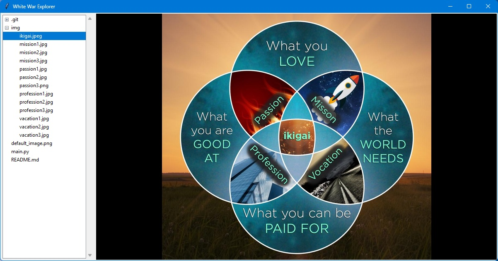

## Table of contents
* [General info](#general-info)
* [Technologies](#technologies)

## General info
This small project is a prototype to create 'OS-WW-P-2'. It had to be the oposite to 'pandasAnalyzer.py'.

## Technologies
* Python version: 3.5

